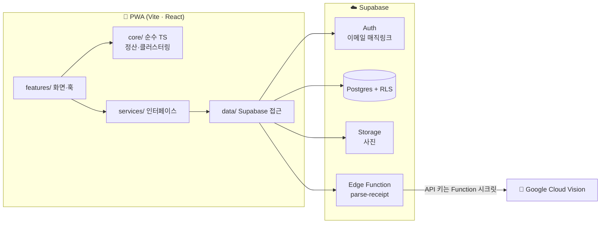

# 🍚 식구(SIKU) — 모임 기록·사진·정산 PWA

[](https://github.com/grinvi04/siku/actions/workflows/ci-gate.yml)


[](LICENSE)
[](https://siku-app.vercel.app)

> **"밥 같이 먹는 사이, 식구 — 모임의 기록·사진·정산을 한 곳에서."**

소규모 모임(저녁모임·자전거·여행)의 **기록 · 사진 · 경비 정산**을 위한 모바일 PWA.
설치 없이 웹으로, 로그인부터 정산까지 한 곳에서 끝낸다.

## 목차

- [📸 스크린샷](#-스크린샷)
- [✨ 주요 기능](#-주요-기능)
- [🧱 기술 스택](#-기술-스택)
- [🏗️ 아키텍처](#️-아키텍처)
- [🚀 시작하기](#-시작하기)
  - [Supabase 셋업](#supabase-셋업-1회)
  - [로그인 셋업](#로그인-셋업-이메일-매직링크-1회)
  - [영수증 OCR 셋업](#영수증-ocr-셋업-google-vision-무료-티어-1회)
- [🧪 테스트](#-테스트)
- [📁 디렉토리](#-디렉토리)
- [🛠️ 개발 규칙](#️-개발-규칙)
- [📚 참고 문서](#-참고-문서)
- [📄 라이선스](#-라이선스)

## 📸 스크린샷

<!-- 로그인 후 화면 캡처를 docs/screenshots/ 에 추가한 뒤 아래 주석을 해제하세요
| 홈 | 정산 | 사진 |
|----|------|------|
|  |  |  |
-->

_준비 중 — 인증 후 화면이라 캡처를 `docs/screenshots/`에 추가 예정._

## ✨ 주요 기능

| 기능 | 설명 |
|---|---|
| 🧾 경비 정산 | 항목별 참여자 선택 → 균등 분할 또는 개인별 금액 지정 → 최소 이체 횟수 계산 → 계좌번호 복사로 송금 (플랫폼 비종속) |
| 📷 사진 | 모임별 갤러리, 촬영 시각·위치 기준 자동 분류 |
| 📍 다녀온 곳 | 사진의 EXIF(위치·시각)로 방문 장소를 자동 재구성 |

## 🧱 기술 스택

| 레이어 | 기술 |
|---|---|
| 프론트엔드 | Vite · React · TypeScript · Tailwind v4 · TanStack Query · React Router |
| 백엔드 | Supabase (Postgres · Auth · Storage · RLS · Edge Functions) |
| OCR | Google Cloud Vision (Edge Function `parse-receipt`) |
| 배포 | Vercel (정적 PWA) |
| 테스트 | Vitest (단위) · Playwright (E2E) |
| CI | GitHub Actions (`ci-gate`) — lint · test · build · E2E |

## 🏗️ 아키텍처



**핵심 원칙**

- **`core/`는 순수 TS** — 정산·클러스터링 로직에 플랫폼 API를 들이지 않아 단위 테스트가 쉽다.
- **플랫폼 API는 `services/` 인터페이스 뒤로** — 구현체(web)는 팩토리로 주입, 도메인은 추상에만 의존.
- **테넌트 격리는 RLS로** — 모든 데이터 접근은 Postgres Row Level Security로 모임·사용자 단위 격리되며, GCP 키는 Edge Function 시크릿에만 두고 클라이언트에 노출하지 않는다.

## 🚀 시작하기

```bash
git clone https://github.com/grinvi04/siku.git
cd siku
npm install
cp .env.example .env       # Supabase URL·anon key 입력 (아래 셋업 참조)
git config core.hooksPath .githooks   # main·develop 직접 커밋 차단 (1회)
npm run dev                # http://localhost:5173
```

> 처음이라면 아래 [Supabase 셋업](#supabase-셋업-1회) → [로그인 셋업](#로그인-셋업-이메일-매직링크-1회) → (선택) [OCR 셋업](#영수증-ocr-셋업-google-vision-무료-티어-1회) 순서로 1회만 설정하면 된다.

### Supabase 셋업 (1회)

1. [supabase.com](https://supabase.com)에서 프로젝트 생성 → Settings → API의 URL과 anon key를 `.env`에
2. `npx supabase db push`로 `supabase/migrations/`를 적용 (supabase CLI를 프로젝트에 링크 후)
   — 권장. SQL Editor에서 파일을 번호 순서대로 직접 실행해도 된다(CLI 미사용 시)

### 로그인 셋업 (이메일 매직링크, 1회)

비밀번호 없이 메일로 받은 1회용 링크(만료 있음)로 로그인한다. 외부 콘솔 의존 없음.

1. Supabase → Authentication → Providers → **Email** 활성화 확인 (기본 활성),
   "Confirm email" 설정은 매직링크 흐름 그대로 사용
2. Authentication → URL Configuration:
   - Site URL: 배포 도메인 (로컬 개발 시 `http://localhost:5173`)
   - Redirect URLs에 `http://localhost:5173/auth/callback`과 `https://<배포도메인>/auth/callback` 추가
3. (운영 시 권장) Supabase 기본 메일 발송은 시간당 횟수 제한이 있으므로
   Authentication → SMTP Settings에 자체 SMTP(예: Resend 무료 티어) 연결

> 소셜 로그인(카카오 등)은 필요해지면 Supabase Provider 추가로 확장 — 현 코드는 auth 레이어만 바꾸면 됨.

### 영수증 OCR 셋업 (Google Vision 무료 티어, 1회)

지출 추가 화면의 "영수증 찍어서 자동 입력"이 사용하는 기능. 월 1,000장까지 무료.
GCP 키는 Edge Function 시크릿에만 저장되고 클라이언트에 노출되지 않는다.

1. [console.cloud.google.com](https://console.cloud.google.com) → 프로젝트 생성 (결제수단 등록 필요 — 무료 한도 내에서는 과금 없음)
2. API 및 서비스 → 라이브러리 → **Cloud Vision API** 활성화
3. API 및 서비스 → 사용자 인증 정보 → **API 키** 생성 → 키 제한에서 "Cloud Vision API"만 허용
4. Supabase CLI 로그인 후 시크릿 등록 + 함수 배포:

```bash
npx supabase login                       # 브라우저 인증 (1회)
npx supabase link --project-ref qbqxhlqjrfdbzlewsdym
npx supabase secrets set GOOGLE_VISION_API_KEY=<발급한 키>
npx supabase functions deploy parse-receipt
```

배포 전까지는 버튼을 눌러도 "영수증을 읽지 못했어요"가 떠서 수동 입력으로 동작한다.

## 🧪 테스트

```bash
npm test           # Vitest 단위 테스트
npm run test:e2e   # Playwright E2E (dev 서버 자동 기동)
npm run lint       # ESLint
npm run build      # 타입 체크 + 프로덕션 빌드
```

`src/core/` 변경은 단위 테스트 동반이 원칙이다.

## 📁 디렉토리

```
src/
├─ core/        순수 TS — 정산·클러스터링 로직 (플랫폼 API 금지, 테스트 용이)
├─ services/    플랫폼 API는 인터페이스 뒤로 (web/ 구현체 + 팩토리)
├─ data/        Supabase 접근 전용 레이어
└─ features/    도메인별 화면·훅

supabase/
├─ migrations/  DB 스키마·RLS·RPC (번호 순)
└─ functions/   Edge Functions (parse-receipt · nearby-places)
```

## 🛠️ 개발 규칙

- 브랜치: `develop → feature/* | fix/* → PR → develop` · 릴리즈 `release/* → main(tag)`. **`main`·`develop` 직접 커밋 금지** (`.githooks/pre-commit`).
- 커밋 전 lint + test 통과 필수. `src/core/` 변경은 단위 테스트 동반.
- 작업 규약·git-flow 커맨드는 [CLAUDE.md](CLAUDE.md) 참고.

## 📚 참고 문서

[AGENTS.md](AGENTS.md) (작업 규약) · [DESIGN.md](DESIGN.md) (디자인 시스템) · [CLAUDE.md](CLAUDE.md) (Claude Code 지침) · [`supabase/migrations/`](supabase/migrations/) (DB 스키마·RLS)

## 📄 라이선스

[MIT](LICENSE)
